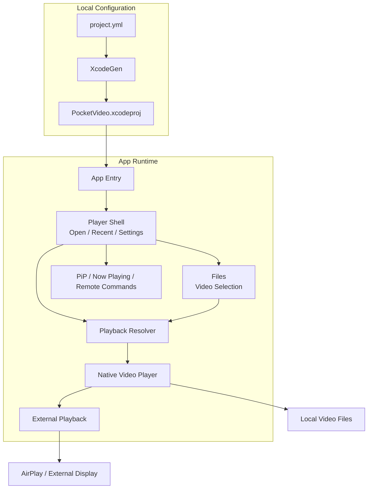

<div id="top"></div>

<div align="right">


</div>


## 目次

- [Pocket Video](#top)
  - [目次](#目次)
  - [リンク一覧](#リンク一覧)
  - [使用技術](#使用技術)
  - [アーキテクチャ](#アーキテクチャ)
  - [環境構築](#環境構築)
  - [テスト](#テスト)
  - [ディレクトリ構成](#ディレクトリ構成)
  - [Gitの運用](#Gitの運用)
    - [ブランチ](#ブランチ)
    - [コミットメッセージの記法](#コミットメッセージの記法)

## リンク一覧

<ul>
  <li><a href="https://www.figma.com/design/l0hfS00kcTqVAzCtJFLiGZ/%E3%82%B9%E3%82%AF%E3%83%AA%E3%83%BC%E3%83%B3%E3%82%B7%E3%83%A7%E3%83%83%E3%83%88?node-id=0-1&t=fKSbhXqkAAxZaDOY-1">Figma</a></li>
</ul>

<p align="right">(<a href="#top">トップへ</a>)</p>

## 使用技術

| Category     | Technology Stack                   |
| ------------ | ---------------------------------- |
| App          | SwiftUI, Swift                     |
| Platform     | iOS                                |
| Integrations | Files, AirPlay, Picture in Picture |
| Design       | Figma                              |
| Development  | Xcode                              |

<p align="right">(<a href="#top">トップへ</a>)</p>

## アーキテクチャ



<p align="right">(<a href="#top">トップへ</a>)</p>

## 環境構築

```
# リポジトリのクローン
git clone git@github.com:Arata1202/PocketVideo.git
cd PocketVideo

# XcodeGenのインストール
brew install xcodegen

# Xcodeプロジェクトの生成
xcodegen generate

# Xcodeから起動
open PocketVideo.xcodeproj
```

```
# iOSリリースビルド
xcodebuild -project PocketVideo.xcodeproj -scheme PocketVideo -configuration Release -destination 'generic/platform=iOS' build
```

<p align="right">(<a href="#top">トップへ</a>)</p>

## テスト

```
# ユニットテスト
xcodebuild -project PocketVideo.xcodeproj -scheme PocketVideo -destination 'platform=iOS Simulator,name=iPhone 16' test
```

<p align="right">(<a href="#top">トップへ</a>)</p>

## ディレクトリ構成

```
❯ tree -a -I ".git|.DS_Store|xcuserdata|DerivedData|build|*.xcuserstate" -L 3
.
├── .docs
│   └── readme
│       └── images
├── .gitignore
├── Brand
│   ├── PocketVideoAppIcon-1024.png
│   └── PocketVideoAppIcon-source.png
├── LICENSE
├── PocketVideo
│   ├── App
│   │   ├── ExternalDisplayPlayback.swift
│   │   └── PocketVideoApp.swift
│   ├── Assets.xcassets
│   │   ├── AppIcon.appiconset
│   │   └── Contents.json
│   ├── Info.plist
│   ├── Models
│   │   ├── PlaybackAlert.swift
│   │   ├── RecentVideo.swift
│   │   └── RecentVideoStore.swift
│   ├── PrivacyInfo.xcprivacy
│   ├── ViewModels
│   │   └── PlayerViewModel.swift
│   ├── Views
│   │   ├── PlayerHomeView.swift
│   │   ├── PlayerView.swift
│   │   └── SettingsView.swift
│   └── ja.lproj
│       └── Localizable.strings
├── PocketVideo.xcodeproj
│   ├── project.pbxproj
│   ├── project.xcworkspace
│   │   ├── contents.xcworkspacedata
│   │   └── xcshareddata
│   └── xcshareddata
├── PocketVideoTests
│   └── RecentVideoStoreTests.swift
├── README.md
└── project.yml

18 directories, 22 files
```

<p align="right">(<a href="#top">トップへ</a>)</p>

## Gitの運用

### ブランチ

GitHub Flowを使用する。
mainとfeatureブランチで運用する。

| ブランチ名 |   役割   | 派生元 | マージ先 |
| :--------: | :------: | :----: | :------: |
|    main    | 本番環境 |   -    |    -     |
| feature/\* | 機能開発 |  main  |   main   |

### コミットメッセージの記法

```
fix: バグ修正
feat: 新機能追加
perf: パフォーマンス改善
refactor: コードのリファクタリング
docs: ドキュメントのみの変更
style: コードのフォーマットに関する変更
test: テストコードの変更
build: ビルドシステムや依存関係の変更
ci: CI/CD設定の変更
revert: 変更の取り消し
chore: その他の変更
```

<p align="right">(<a href="#top">トップへ</a>)</p>
