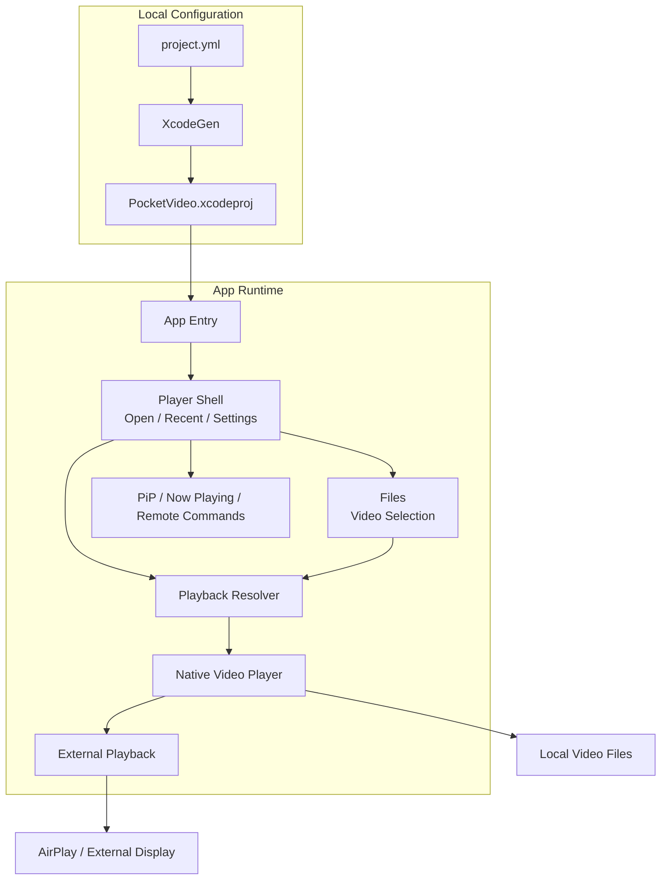

<p align="center">
  
</p>

# Pocket Video

ファイルに保存した動画を再生できる、無料のiOS動画プレイヤーです。

[App Storeでダウンロード](https://apps.apple.com/jp/app/pocket-video/id6783846586)

## 主な機能

- ファイルアプリや共有メニューから動画を開く
- 最近開いた動画を、前回の再生位置から再開
- AirPlay・外部ディスプレイでの再生
- ピクチャ・イン・ピクチャでの再生

## 開発環境

macOS、Xcode、[Homebrew](https://brew.sh/)が必要です。アプリの対応OSはiOS 17以降です。
Xcodeプロジェクトは `project.yml` からXcodeGenで生成します。

```bash
git clone https://github.com/Arata1202/PocketVideo.git
cd PocketVideo
brew install xcodegen
xcodegen generate
open PocketVideo.xcodeproj
```

Xcodeで `PocketVideo` スキームとiOSシミュレーターを選んで実行してください。
実機で実行する場合は、Signing & Capabilitiesで自分の開発チームを設定してください。

## テスト

```bash
xcodebuild -project PocketVideo.xcodeproj -scheme PocketVideo -showdestinations
xcodebuild -project PocketVideo.xcodeproj -scheme PocketVideo -destination 'platform=iOS Simulator,name=iPhone 16' test
```

`iPhone 16` は、最初のコマンドで表示された利用可能なシミュレーター名に置き換えてください。
CIではシミュレーター向けビルドとユニットテストを実行します。
AirPlayや外部ディスプレイの動作は、対応する実機で確認してください。

## 使用技術

| Category     | Technology Stack                   |
| ------------ | ---------------------------------- |
| App          | SwiftUI, Swift                     |
| Platform     | iOS                                |
| Integrations | Files, AirPlay, Picture in Picture |
| Design       | Figma                              |
| Development  | Xcode                              |

## アーキテクチャ



## ディレクトリ構成

```text
PocketVideo/       アプリ本体
PocketVideoTests/  ユニットテスト
Brand/             アプリアイコン
project.yml        XcodeGenのプロジェクト定義
```

デザイン資料は[Figma](https://www.figma.com/design/l0hfS00kcTqVAzCtJFLiGZ/)にあります。

## コントリビューション

不具合報告、改善提案、ドキュメント修正、プルリクエストを歓迎します。
参加方法は[コントリビューションガイド](CONTRIBUTING.md)をご覧ください。

## ライセンス

[MIT License](LICENSE)
